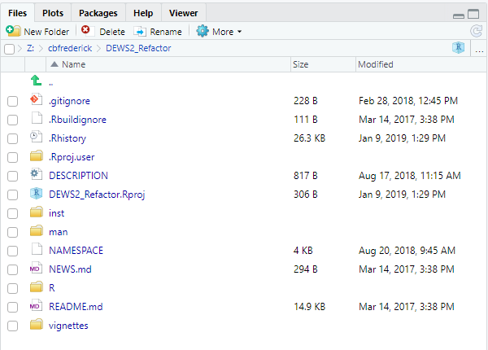
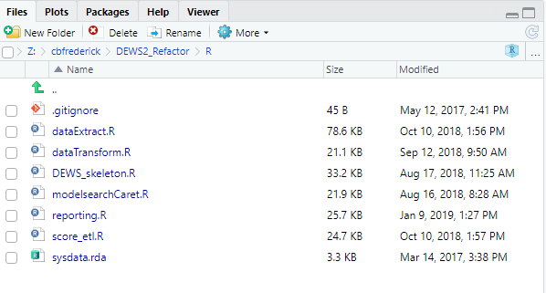
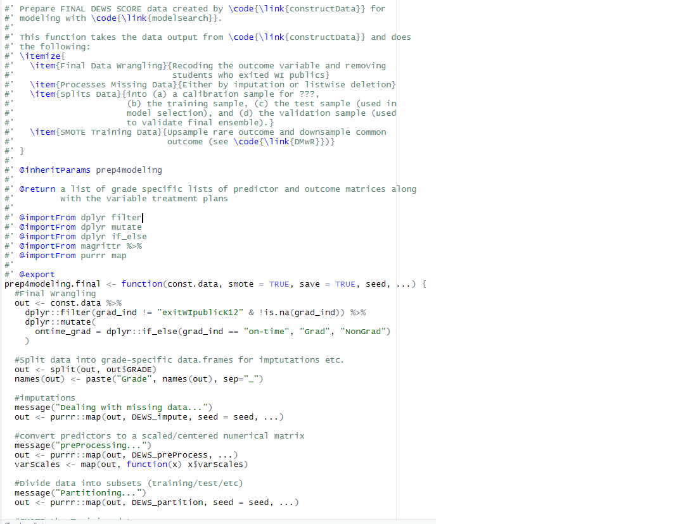
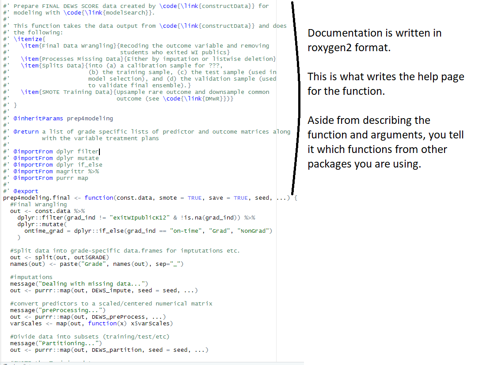
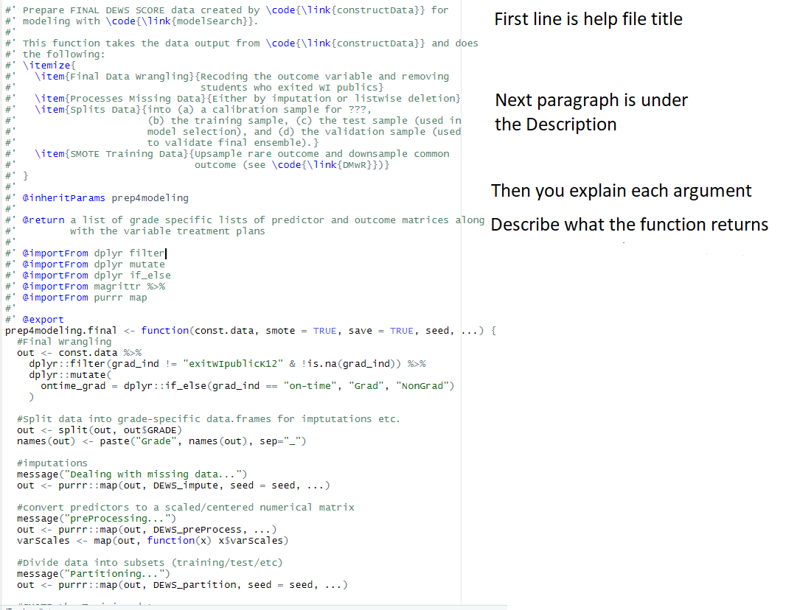
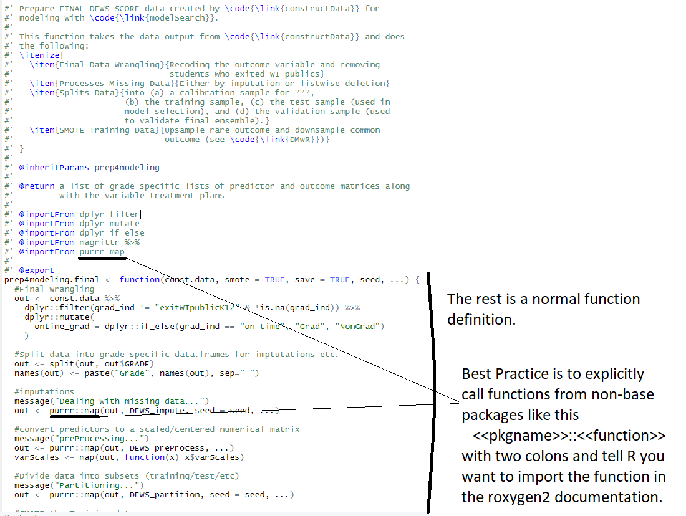

```{r setup, include=FALSE}
knitr::opts_chunk$set(echo = FALSE)
library(tidyverse)
library(kableExtra)
```

## What should go into a package?

At the most basic level, packages are exactly what they sound like: bundles 
of related **code**, **data** and **other miscellaneous things*** that are 
easily** **shared** with others.

The are perhaps the ultimate incarnation of reproducible research/data 
analysis. Basically, you avoid this situation:


*These can be Rmarkdown templates, vingettes, demos, and really anything else R can produce.

**I didn't say the easiest, but it is the easiest best way to share them.

## Why should you make a package?

  a) It's fun!
  b) You have a set of functions you find yourself using over and over again and
     are tired of copy-pasting them from one syntax file to the other.
  c) You have developed some method/technique that will add value to the greater
     community of R users.
  d) You have an ongoing/recurring fairly routinized project that you want to 
     automate as much as possible.
  e) You want to learn a bit more about how R works.
  f) You need another vanity project to show everybody how clever you are.
  g) You have done an analysis and want to be able to go back to it and
     reproduce everything.

## Why have I written packages?

At least one of the five fairly mature packages that I help maintain have 
been inspired by each of the motivations from the previous slide. Ultimately,
each package has solved a problem for its intended audiences:

```{r}
tribble(
  ~Package, ~Solution, ~Audience,
  "merTools", 
  "Post-analysis and convenience funtions for dealing with (especially large) multi-level models.",
  "The world (on CRAN)",
  "dpiR", 
  "Make repeated data tasks here at DPI more efficient and accessible.",
  "DPI data folks",
  "DEWS", 
  "Automate the process of pulling data choosing models, exporting predictions, and QA'ing the annual DEWS scores.",
  "The person who runs DEWS",
  "dpiDataPull",
  "Standardize data sent for confidential data requests, including documentation",
  "P&B and anyone else who fulfills these requests.",
  "teacherEquityReport",
  "Automate the process of creating and staging the Inequitable Distribution Reports for Districts.",
  "The person who runs the reports"
) %>% 
  knitr::kable() %>% 
  kable_styling(c("striped", "condensed"))
```

## Why you should make a package

There is a saying that if you find yourself copy-pasting a chunk of code more
than 3 times, you should write a function instead. I think the same rule should 
hold for functions and packages.

The biggest reason to make a package is to solve a recurring problem whether
it happens to multiple people alot or just future you. 

Aside from the convenience of having the function ready for you, developing
your functions into a full-fledged package imposes structures to help you 
document and test your code so that it is more robust.

## Anatomy of a package



- DESCRIPTION: metadata about your package, what it does, who wrote it, etc.
- NAMESPACE: don't worry about this the computer writes it ... in fact don't touch it.
- R/: where the functions go.
- The rest is extra stuff that may or may not be necessary.

## DESCRIPTION
<pre>
```{r, results='asis'}
cat(readLines("Z:/cbfrederick/DEWS2_Refactor/DESCRIPTION"), sep = "\n")
```
</pre>

## NAMESPACE
<pre>
```{r, results='asis'}
cat(readLines("Z:/cbfrederick/DEWS2_Refactor/NAMESPACE"), sep = "\n")
```
</pre>

## R/



I group similar functions into single files. They are regular .R syntax files 
that you can run from the source pane with fancy/structured comments.

## R/dataTransform.R



## R/dataTransform.R



## R/dataTransform.R



## R/dataTransform.R



## Making a package with RStudio and `devtools`

This combination makes package authoring fairly straightforward. 

- Start a new R-project from RStudio and choose "package" for the type of 
  project.
  
- Take advantage of the `devtools` functions so that everything is formatted
  correctly.
  
- Note: `devtools` recently went through a fairly large change so you may get
  warnings about functions being depricated if you follow the advice in the
  resources below.  Don't worry, the error messages are fairly helpful.

## Good tutorials/references (1)

](hilaryparker_screenshot.png)

## Good tutorials/references (2)

](karlbroman_screenshot.png)

## Good tutorials/references (3)

](r-packages_screenshot.png)

## Good tutorials/references (4)

](devtools_screenshot.png)


## Sharing your package with others

- CRAN (Public) ... if you think it will be useful to others. This has a fairly high 
  bar to meet.
    
- Github (Public, unless you have a private account) ... nice place to share 
  informal or nascent packages.

- Bitbucket (Public or offer limited (5 people) free private teams) ... similar to
  github.

- By hand (Private) ... This is harder than it should be. The easiest way is
  to build the file to a binary (OS specific) and install via:
```
  install.packages("path/to/packagename.zip", repos = NULL)
```